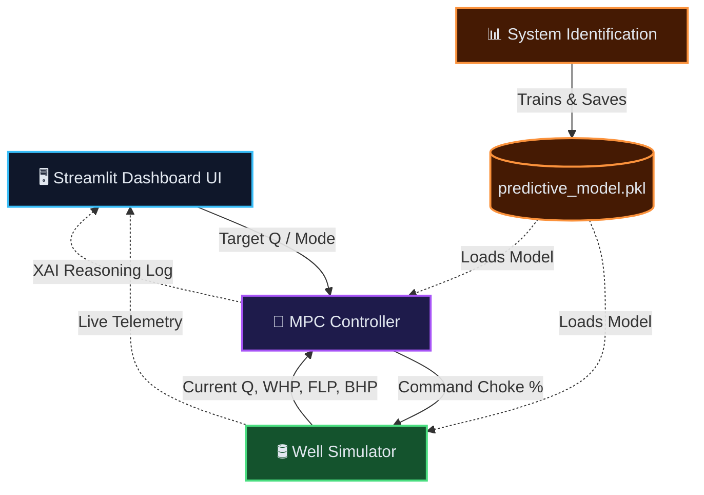

# 🛢️ Autonomous Production Choke Controller (Honeywell Hackathon PS3)


> **A cutting-edge Model Predictive Controller (MPC) and Digital Twin UI for autonomous choke management of a single naturally flowing oil well.**

🚀 **Live Demo:** [https://ashfaque-honeywell3.streamlit.app/](https://ashfaque-honeywell3.streamlit.app/)

---

## 📖 Overview

In modern oil & gas production, regulating the flow of fluids while maintaining safe wellhead, flowline, and bottom-hole pressures is a delicate balancing act. 

This project delivers an **autonomous choke control solution** that replaces manual operator adjustments. It uses a custom Receding Horizon Model Predictive Controller (MPC) shielded by inertia-aware safety layers to hit production targets safely. 

When targets are impossible to hit without breaching safety constraints, the controller seamlessly transitions into an **Edge-Riding Mode** to maximize production along the safe operational ceiling.

---

## ✨ Key Features

- **🧠 3-Layer Safety-Shielded MPC**: 
  - **Layer 1 (Receding Horizon):** Simulates 3 steps ahead to check for violations and attempts recovery pullbacks if needed.
  - **Layer 2 (Inertia-Aware Buffer):** Velocity-based pre-emption to stop fast-moving pressure transients before they breach hard limits.
  - **Layer 3 (Edge-Riding):** Gracefully handles infeasible production targets by riding the safety constraints.
- **🖥️ Glassmorphism SCADA Dashboard**: A premium, dark-mode Streamlit UI featuring a live P&ID (Piping and Instrumentation Diagram) digital twin.
- **🗣️ Explainable AI (XAI)**: A terminal-style log that prints the controller's exact reasoning, predicted states, and rejection logic for every single decision.
- **🤖 Surrogate ML Simulator**: Uses a `RandomForestRegressor` and `MultiOutputRegressor` trained on step-test data to simulate the well dynamics.

---

## 🏗️ Architecture



---

## 📂 Project Structure

```text
📦 Ash_Honeywell
 ┣ 📂 .streamlit/               # Dark SCADA theme config
 ┣ 📜 config.py                 # Single source of truth (constraints, limits)
 ┣ 📜 system_identification.py  # Data analysis & ML model training script
 ┣ 📜 simulator.py              # ML-based surrogate well simulator
 ┣ 📜 mpc_controller.py         # The brain (3-layer MPC + XAI)
 ┣ 📜 dashboard.py              # Streamlit SCADA application
 ┣ 📜 requirements.txt          # Python dependencies
 ┗ 📜 predictive_model.pkl      # Pre-trained Random Forest model
```

---

## 🚀 Quick Start

### 1. Install Dependencies
Ensure you have Python 3.10+ installed, then run:
```bash
pip install -r requirements.txt
```

### 2. Train the Surrogate Model (Optional)
*Note: The project already includes a pre-trained `predictive_model.pkl`. You only need to run this if you want to regenerate the model and view the step-response plots.*
```bash
python system_identification.py
```
This will output a `step_test_response.html` file with rich Plotly analytics.

### 3. Launch the Digital Twin Dashboard
```bash
streamlit run dashboard.py
```

---

## 🎮 Testing Scenarios

The dashboard comes pre-configured with three critical scenarios you can select from the sidebar:

1. **Scenario A (Startup to Target)**: Brings the well from a cold-start to a feasible production target.
2. **Scenario B (Target Tracking)**: Simulates a mid-run target step change, forcing the controller to adjust on the fly.
3. **Scenario C (Infeasible Target)**: Requests a target that exceeds safe production limits. Watch the XAI log as the controller refuses the unsafe target and engages **Edge-Riding Mode** to safely maximize flow.

---

## 💡 Developer Tips

> [!TIP]
> **Swapping Simulators:** When the real Honeywell simulator is provided, simply replace the `simulator.py` file to match their API. `config.py` and `mpc_controller.py` are completely decoupled and require zero changes!

> [!NOTE]
> **Chaos Injection:** Use the red chaos injection buttons in the dashboard sidebar to simulate sudden subsurface or wellhead pressure spikes. The MPC will immediately detect the anomaly and slam the choke shut to protect the equipment.
